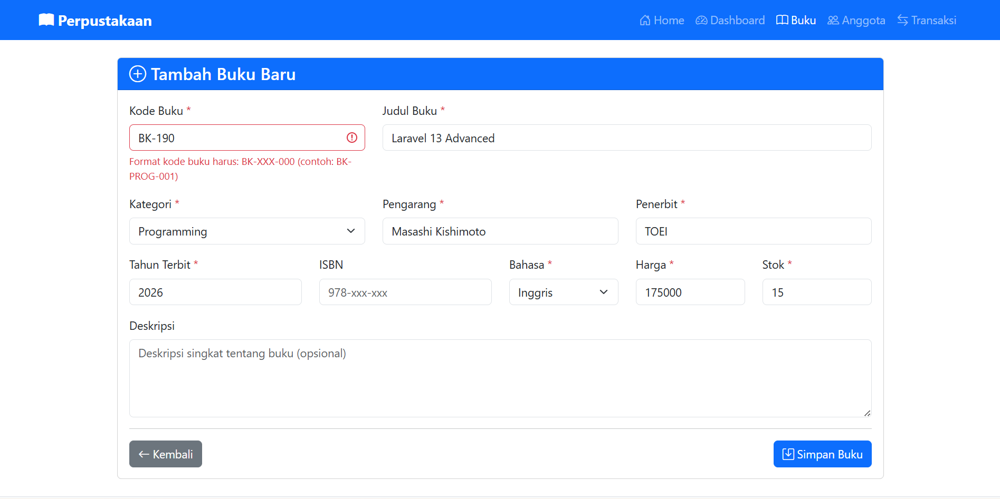
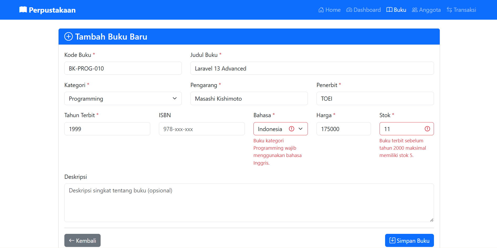
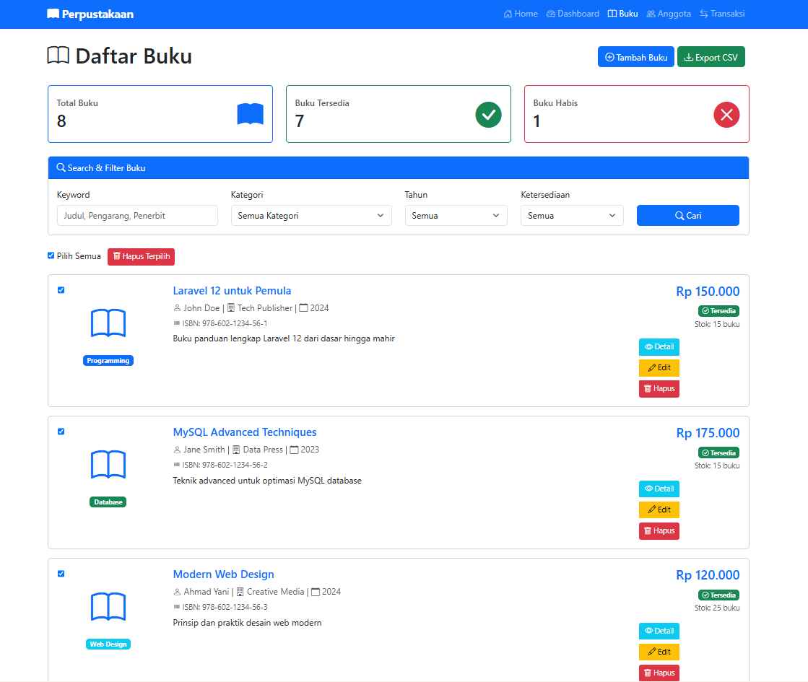
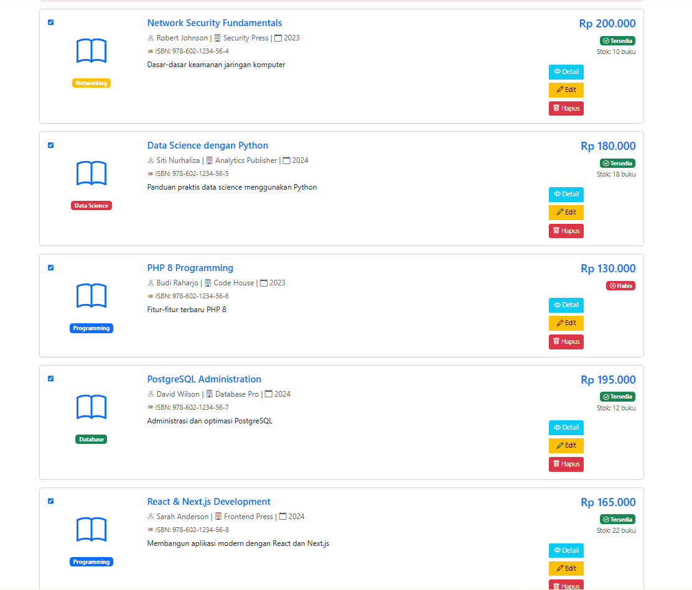
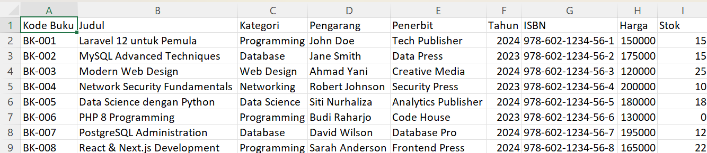

# CRUD-Buku-dengan-Laravel
Mempelajari cara membuat form input, validasi data, menyimpan ke database, menampilkan, mengupdate, dan menghapus data dengan memanfaatkan Eloquent ORM dan fitur-fitur Laravel seperti Form Request validation, CSRF protection, dan flash messages.

## Tugas Pertemuan 12

**Nama:** Bima Adi Nugroho  
**NIM:** 60324077  

---

## Tugas 1: Validation Rules Advanced
Tambahkan validation rules advanced untuk field-field tertentu.

### Custom Validation Rule untuk Kode Buku

---

### Conditional Validation

---

## Tugas 2: Bulk Delete Operations
Implementasi fitur delete multiple buku sekaligus.

### Select All Checkbox 

---

## Export Buku ke CSV
Tambahkan fitur export data buku ke file CSV.

### Dokumentasi setelah menjalankan Export ke CSV

